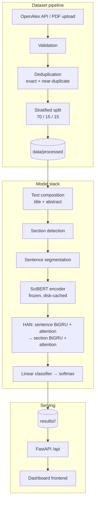

# Academic Research Paper Classification using Hierarchical Attention Networks and Transformer Embeddings

**Academic Research Intelligence System (ARIS)** — an explainable research-paper
classifier and research-intelligence dashboard. Papers are classified into
research domains by a SciBERT + Hierarchical Attention Network (HAN), with the
network's **real attention weights** served as evidence, and the results explored
through a dark-themed dashboard backed by a FastAPI service.

> **On the numbers in this repo.** Every metric shown in the dashboard comes from
> a training run's artifacts under `results/<run_id>/` — never hard-coded. Runs
> trained on the committed synthetic fixture are labelled as such in the UI,
> because a separable-by-construction corpus measures the wiring, not the science.

---

## Project overview

| Layer | What it does |
|---|---|
| `src/ingestion/` | OpenAlex API ingestion + PDF parsing (`pypdf`) into a common `PaperDocument` |
| `src/data_pipeline/` | Validation, exact + near-duplicate deduplication, stratified 70/15/15 split |
| `src/preprocessing/` | Section detection, sentence segmentation, text normalisation |
| `src/models/` | `BaseClassifier` contract; TF-IDF baselines, Transformer classifier, SciBERT + HAN |
| `src/training/` | Run orchestration: fit on train only, score held-out splits, persist artifacts |
| `src/evaluation/` | Metrics (macro-F1 primary), confusion matrices, per-class reports, run manifests |
| `src/api/` | FastAPI service: read-only over a finished run, plus live classification |
| `frontend/` | Framework-free dark dashboard (ES modules, no build step) served by the API |
| `configs/` | Every path, seed, threshold, and hyperparameter — nothing hard-coded in code |
| `tests/` | 346 unit + integration tests, including an end-to-end pipeline test |

## Architecture



## Installation

Requires **Python 3.11–3.13**.

```bash
python -m venv .venv
.venv\Scripts\pip install -r requirements.txt          # core stack + API
.venv\Scripts\pip install --index-url https://download.pytorch.org/whl/cpu -r requirements-ml.txt
```

Copy `.env.example` to `.env` and set what you need (`OPENALEX_MAILTO` for
ingestion, `ARIS_API_KEY` to protect a network-exposed API, `GROQ_API_KEY`
optionally for LLM-polished Q&A answers).

## Dataset

The corpus is built from **OpenAlex** (CC0) — real papers, labelled by their
position in the OpenAlex topic hierarchy. The default label space is the 11
Computer Science subfields (deliberately confusable classes); a 26-domain
field-level space is one config switch (`labels.taxonomy_level: field`).

```bash
python scripts/build_dataset.py --source data/sample   # or fetch from OpenAlex
```

The build validates (missing labels, empty/short documents, language, class
imbalance), deduplicates (exact keys + shingle-Jaccard near-duplicates so no
paper straddles train and test), and writes a manifest with per-file SHA-256
hashes. Splits are stratified 70/15/15; the test split is touched only for final
evaluation.

## Training

```bash
# Baselines (Milestone 1)
python scripts/train_baseline.py --model tfidf_logreg
python scripts/train_baseline.py --model tfidf_svm

# Final model (Milestone 2+; first run downloads SciBERT ~440 MB)
python scripts/train_han.py --run-id scibert_han_v1
```

Each run writes a self-describing directory to `results/<run_id>/`:
`metrics.json`, `classification_report.json`, confusion-matrix and
class-distribution figures, per-paper predictions for every scored split, the
fitted model, the resolved configuration (secrets excluded), and a provenance
manifest (seed, git commit, package versions, dataset hashes).

Reproducibility: one global seed propagates to numpy / sklearn / PyTorch /
`random`; a run never overwrites an existing run directory.

## Model architecture

### Transformer embeddings

`allenai/scibert_scivocab_uncased` — BERT trained on 1.14M Semantic Scholar
papers, which is why it beats generic BERT on scientific text out of the box.
The encoder stays **frozen**; only the head trains, which is what makes the
pipeline tractable on CPU. Sentence embeddings are cached on disk keyed by text
hash, so repeated inference never re-encodes unchanged sentences.

### Hierarchical Attention Network

Long papers are never crammed into one Transformer sequence. The hierarchy is:

```
Paper → sections → sentences (config-bounded: max_sections, max_sentences_per_section)
  → SciBERT sentence embeddings
  → Level 1: sentence BiGRU          → Level 2: additive sentence attention
  → section representations
  → Level 3: section BiGRU           → Level 4: additive section attention
  → Level 5: document representation → dropout → Level 6: linear classifier → softmax
```

**The attention is real.** Weights come from additive (Bahdanau-style) scoring
inside the trained network — `softmax(vᵀ tanh(W h))` over encoder states — and
are returned by the network at inference (`predict_with_attention`), aligned
back to the source sentences and sections by `HANClassifier.explain`. Nothing is
heuristic or hand-projected.

**What attention is and is not.** Attention weights are an evidence
*visualisation*: they show where the model looked while deciding, not why the
paper belongs to a class. The UI says "model attention / evidence", never
"this proves the category".

## Evaluation

Every run reports accuracy, precision, recall, F1 (macro / micro / weighted),
per-class metrics, and confusion matrices. **Macro F1 is the model-selection
metric** — it weights every class equally and so is not flattered by the largest
class. The SVM baseline exposes margins rather than probabilities; the payload
labels which quantity each confidence is (`confidence_kind`), and a margin is
never presented as a percentage.

## Experiments and ablation

The model registry in `configs/model.yaml` makes baselines config entries, and
`scripts/train_baseline.py` / `scripts/train_han.py` write comparable run
directories, so the experiment table is a matter of training each model and
reading the manifests:

| Model | What it isolates |
|---|---|
| TF-IDF + Logistic Regression | Classical bag-of-words floor |
| TF-IDF + Linear SVM | Margin-based classical baseline |
| SciBERT + linear head | Value of scientific Transformer embeddings |
| SciBERT + HAN | Value of hierarchical attention on top |

The ablation question — *does hierarchical attention actually help?* — is
answered by comparing the SciBERT+linear run against the SciBERT+HAN run on the
same dataset build (both manifests record identical dataset hashes, so the
comparison is apples-to-apples). Per-class metrics and the confusion matrices
show *where* the model fails; the prediction files support error analysis by
domain pair, confidence band, and document length.

Two pre-trained runs ship in `results/` against the committed synthetic
fixture:

* `m1-tfidf_logreg` — the Milestone-1 baseline (TF-IDF + Logistic Regression),
  default for the rest of the Milestone-1 evaluation. Macro F1 on the
  separable synthetic corpus is 1.0; that is a wiring check, not a science
  result.
* `scibert_han_v1` — the SciBERT + Hierarchical Attention Network on the same
  fixture, with the frozen-encoder head. Macro F1 is below 1.0 on a
  56-document training set, which is the expected wiring-vs-science split for
  a small corpus. The section-attention panel renders this run's real
  attention weights.

Switch the active run with `configs/api.yaml -> runs.default_run_id`, or pass
`--run-id` to `scripts/serve_api.py`.

## API

`python scripts/serve_api.py` serves the dashboard and API from one origin
(same-origin `fetch` needs no CORS). Interactive docs at `/api/docs`.

| Endpoint | Purpose |
|---|---|
| `GET /api/health` | Liveness + what loaded (unauthenticated) |
| `GET /api/meta` | Everything the dashboard needs for first paint |
| `GET /api/papers` | Corpus browsing (split filters, search, review flag) |
| `POST /api/papers/classify` | Live classification of new text |
| `POST /api/papers/upload` | PDF upload → parse → classify |
| `GET /api/papers/{id}/similar` | Nearest neighbours (TF-IDF or SciBERT cosine, per model) |
| `GET /api/papers/{id}/explanation` | Term contributions or real HAN attention |
| `POST /api/papers/{id}/ask` | Passage-retrieval Q&A with section provenance |
| `GET /api/runs`, `/api/runs/active` | Run discovery and selection |

Unavailable features report `available: false` with a reason rather than
returning approximations. The API trains nothing; it reads a completed run.

## Deployment

A `Dockerfile` and `docker-compose.yml` are included. For anything reachable
beyond loopback: set `ARIS_API_KEY`, pass `--require-api-key`, and replace the
CORS wildcard with explicit origins. Detailed errors go to logs; users see
actionable messages, never stack traces.

## Limitations

- The committed demo corpus is a synthetic fixture; its metrics are wiring
  checks. Train on a real OpenAlex build for research numbers.
- Confidence scores are uncalibrated — treat them as rankings, not likelihoods.
- Attention weights are evidence, not explanations; low attention does not mean
  a section was not important to a human reader.
- Q&A answers are extractive (optionally LLM-polished over retrieved passages)
  and refuse when the paper does not contain the answer.
- No user accounts; a single shared API key is the whole auth surface.

## Future work

- Fine-tune the encoder end-to-end on a GPU corpus-scale run.
- Multi-label classification (the pipeline already supports the mode).
- FAISS/pgvector-backed vector store behind the similarity interface.
- Experiment tracking (MLflow) and dataset versioning (DVC) hooks.
- Citation-graph module (OpenAlex `referenced_works` is already ingested).
</path>
</write_to_file># nlp_2

